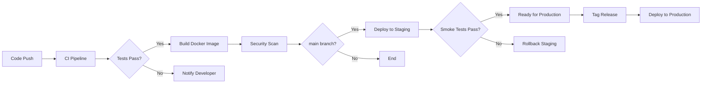

# FaultMaven Auth Service - Enterprise Edition
## CI/CD Pipeline Documentation

This document describes the Continuous Integration and Continuous Deployment pipelines for the FaultMaven Auth Service.

---

## Table of Contents

- [Overview](#overview)
- [CI Pipeline](#ci-pipeline)
- [CD Pipeline](#cd-pipeline)
- [GitHub Actions Workflows](#github-actions-workflows)
- [Secrets Configuration](#secrets-configuration)
- [Deployment Environments](#deployment-environments)
- [Release Process](#release-process)
- [Rollback Procedures](#rollback-procedures)
- [Monitoring CI/CD](#monitoring-cicd)

---

## Overview

### Pipeline Architecture



### Key Principles

- **Automated Testing**: Every commit runs full test suite
- **Security First**: Security scanning at multiple stages
- **Infrastructure as Code**: All infrastructure changes versioned
- **Zero-Downtime Deployments**: Rolling updates with health checks
- **Easy Rollback**: One-click rollback to previous version
- **Observability**: Full tracing of deployments and changes

---

## CI Pipeline

### Workflow: `.github/workflows/ci.yml`

**Triggers:**
- Push to any branch
- Pull requests to `main` or `develop`

**Jobs:**

#### 1. Code Quality (`lint`)

Runs in parallel to provide fast feedback.

**Steps:**
- Checkout code
- Setup Python 3.11
- Install linting tools
- Run Black (code formatting)
- Run isort (import sorting)
- Run Flake8 (linting)
- Run MyPy (type checking)
- Run Bandit (security linting)

**Pass Criteria:**
- All code formatted with Black
- Imports sorted correctly
- No linting errors
- Type hints validated
- No high-severity security issues

#### 2. Test Suite (`test`)

Comprehensive testing with coverage reporting.

**Steps:**
- Checkout code
- Setup Python 3.11
- Start PostgreSQL service
- Start Redis service
- Install dependencies
- Run unit tests (70%+ coverage required)
- Run integration tests
- Run security tests
- Upload coverage to Codecov

**Pass Criteria:**
- All unit tests pass
- All integration tests pass
- All security tests pass
- Code coverage ≥ 70%

#### 3. Security Scan (`security`)

Multiple security scanning tools.

**Steps:**
- Run Trivy filesystem scan
- Upload results to GitHub Security
- Run Snyk dependency scan

**Pass Criteria:**
- No critical vulnerabilities
- No high-severity issues in dependencies

#### 4. Build Docker Image (`build`)

Only runs on `push` events (not PRs).

**Steps:**
- Setup Docker Buildx
- Login to Docker Hub
- Extract metadata (tags, labels)
- Build and push Docker image
- Scan Docker image with Trivy
- Upload scan results

**Pass Criteria:**
- Docker image builds successfully
- No critical vulnerabilities in image
- Image size < 500MB

### Running CI Locally

**Linting:**
```bash
# Install tools
pip install black flake8 isort mypy bandit

# Run all checks
black --check enterprise/ tests/
isort --check-only enterprise/ tests/
flake8 enterprise/ tests/ --max-line-length=100
mypy enterprise/ --ignore-missing-imports
bandit -r enterprise/ -ll
```

**Testing:**
```bash
# Start dependencies
docker-compose up -d postgres redis

# Run tests
pytest -v -m unit --cov=enterprise --cov-fail-under=70
pytest -v -m integration
pytest -v -m security

# Stop dependencies
docker-compose down
```

**Docker Build:**
```bash
docker build -t fm-auth-service-enterprise:local .
docker run --rm fm-auth-service-enterprise:local alembic --version
```

---

## CD Pipeline

### Workflow: `.github/workflows/cd.yml`

**Triggers:**
- Push to `main` branch → Deploy to Staging
- Tag matching `v*.*.*` → Deploy to Production

### Staging Deployment

**Jobs: `deploy-staging`**

**Steps:**
1. Checkout code
2. Configure AWS credentials
3. Login to Amazon ECR
4. Build and push image to ECR (tagged `staging-SHA`)
5. Update ECS service (force new deployment)
6. Wait for services to stabilize
7. Run smoke tests

**Smoke Tests:**
```bash
curl -f https://auth-staging.faultmaven.com/health
curl -f https://auth-staging.faultmaven.com/ready
```

**Pass Criteria:**
- Image built and pushed successfully
- ECS service updated
- Health checks pass
- Smoke tests pass

### Production Deployment

**Jobs: `deploy-production`**

**Requirements:**
- Manual approval required (GitHub Environment protection)
- Tag format: `v*.*.*` (semantic versioning)

**Steps:**
1. Checkout code at tag
2. Extract version from tag
3. Configure AWS credentials (production)
4. Login to Amazon ECR
5. Build and push image (tagged `vX.Y.Z` and `latest`)
6. **Run database migrations** (separate ECS task)
7. Update ECS service (rolling deployment)
8. Wait for services to stabilize
9. Run smoke tests
10. Create GitHub release
11. Notify via Slack

**Rolling Deployment Configuration:**
```json
{
  "maximumPercent": 200,
  "minimumHealthyPercent": 100
}
```

This ensures zero downtime:
- New tasks start before old ones stop
- At least 100% capacity maintained
- Up to 200% capacity during deployment

**Pass Criteria:**
- All staging tests passed
- Manual approval received
- Database migrations successful
- ECS service updated
- Health checks pass
- Smoke tests pass

---

## GitHub Actions Workflows

### File Structure

```
.github/
└── workflows/
    ├── ci.yml          # Continuous Integration
    ├── cd.yml          # Continuous Deployment
    └── release.yml     # Release automation
```

### Workflow: `ci.yml`

**Purpose**: Run tests and build on every commit

**Triggers**:
```yaml
on:
  push:
    branches: [main, develop, feature/**]
  pull_request:
    branches: [main, develop]
```

**Key Features**:
- Parallel job execution (lint + test)
- Caching for faster builds
- Coverage reporting to Codecov
- Security scanning
- Docker image building

### Workflow: `cd.yml`

**Purpose**: Deploy to staging and production

**Triggers**:
```yaml
on:
  push:
    branches: [main]      # Staging
    tags: ['v*.*.*']      # Production
```

**Key Features**:
- Environment-specific deployments
- Manual approval gates
- Database migrations
- Rolling updates
- Smoke testing
- Slack notifications

### Workflow: `release.yml`

**Purpose**: Create GitHub releases and publish to Docker Hub

**Triggers**:
```yaml
on:
  push:
    tags: ['v*.*.*']
```

**Key Features**:
- Automatic changelog generation
- GitHub release creation
- Docker Hub publishing
- Multi-tag images (version + latest)
- Docker Hub description update

---

## Secrets Configuration

### Required GitHub Secrets

**For CI:**
- `CODECOV_TOKEN`: Codecov upload token
- `SNYK_TOKEN`: Snyk security scanning token (optional)

**For Docker Hub:**
- `DOCKER_USERNAME`: Docker Hub username
- `DOCKER_PASSWORD`: Docker Hub password or token

**For Staging Deployment:**
- `AWS_ACCESS_KEY_ID`: AWS access key for staging
- `AWS_SECRET_ACCESS_KEY`: AWS secret key for staging

**For Production Deployment:**
- `AWS_ACCESS_KEY_ID_PROD`: AWS access key for production
- `AWS_SECRET_ACCESS_KEY_PROD`: AWS secret key for production
- `GITHUB_TOKEN`: Automatically provided by GitHub
- `SLACK_WEBHOOK`: Slack webhook URL for notifications

### Setting Secrets

**Via GitHub UI:**
1. Go to repository Settings
2. Navigate to Secrets and variables → Actions
3. Click "New repository secret"
4. Add name and value
5. Click "Add secret"

**Via GitHub CLI:**
```bash
gh secret set DOCKER_USERNAME --body "your-username"
gh secret set DOCKER_PASSWORD --body "your-token"
gh secret set AWS_ACCESS_KEY_ID --body "AKIA..."
gh secret set AWS_SECRET_ACCESS_KEY --body "secret-key"
```

---

## Deployment Environments

### GitHub Environments

Configure environments for deployment protection:

**Staging:**
- No approval required
- Deploy on every `main` branch push
- URL: https://auth-staging.faultmaven.com

**Production:**
- Manual approval required
- Restricted to tags only
- URL: https://auth.faultmaven.com

**Creating Environments:**

1. Go to repository Settings
2. Navigate to Environments
3. Click "New environment"
4. Name: `staging` or `production`
5. Configure protection rules:
   - Required reviewers (for production)
   - Wait timer (optional)
   - Deployment branches (tags only for prod)

### Environment Variables

**Staging:**
```yaml
ENVIRONMENT: staging
DATABASE_URL: <staging-db-url>
REDIS_URL: <staging-redis-url>
JWT_SECRET_KEY: <staging-jwt-secret>
LOG_LEVEL: DEBUG
```

**Production:**
```yaml
ENVIRONMENT: production
DATABASE_URL: <prod-db-url>
REDIS_URL: <prod-redis-url>
JWT_SECRET_KEY: <prod-jwt-secret>
LOG_LEVEL: INFO
```

---

## Release Process

### Semantic Versioning

Follow [Semantic Versioning](https://semver.org/):

- **MAJOR.MINOR.PATCH** (e.g., `v1.2.3`)
  - **MAJOR**: Breaking changes
  - **MINOR**: New features (backward compatible)
  - **PATCH**: Bug fixes

### Creating a Release

**Step 1: Update Version**

Update version in relevant files:
- `enterprise/main.py` (version string)
- `CHANGELOG.md` (add release notes)

**Step 2: Commit Changes**

```bash
git add enterprise/main.py CHANGELOG.md
git commit -m "chore: bump version to 1.2.3"
git push origin main
```

**Step 3: Create Tag**

```bash
# Create annotated tag
git tag -a v1.2.3 -m "Release v1.2.3"

# Push tag to trigger deployment
git push origin v1.2.3
```

**Step 4: Monitor Deployment**

1. Go to Actions tab in GitHub
2. Watch `CD - Deploy` workflow
3. Review deployment logs
4. Approve production deployment when prompted

**Step 5: Verify Release**

```bash
# Check health
curl https://auth.faultmaven.com/health

# Verify version
curl https://auth.faultmaven.com/ | jq .version
```

### Pre-release Versions

For beta/RC versions:

```bash
# Tag as pre-release
git tag -a v1.2.3-beta.1 -m "Release v1.2.3-beta.1"
git push origin v1.2.3-beta.1
```

GitHub Actions will mark it as a pre-release automatically.

---

## Rollback Procedures

### Automatic Rollback

If smoke tests fail, deployment stops automatically.

### Manual Rollback

**Via GitHub Actions (Recommended):**

1. Go to Actions tab
2. Select `CD - Deploy` workflow
3. Click "Run workflow"
4. Select `rollback-production` job
5. Click "Run workflow"

**Via AWS CLI:**

```bash
# Get previous task definition
PREVIOUS_TASK_DEF=$(aws ecs describe-services \
  --cluster faultmaven-production \
  --services auth-service \
  --query 'services[0].deployments[1].taskDefinition' \
  --output text)

# Rollback
aws ecs update-service \
  --cluster faultmaven-production \
  --service auth-service \
  --task-definition $PREVIOUS_TASK_DEF

# Monitor rollback
aws ecs wait services-stable \
  --cluster faultmaven-production \
  --services auth-service
```

**Via Kubernetes:**

```bash
# Rollback to previous revision
kubectl rollout undo deployment/auth-service

# Rollback to specific revision
kubectl rollout undo deployment/auth-service --to-revision=2

# Monitor rollback
kubectl rollout status deployment/auth-service
```

### Database Rollback

If migration needs to be reverted:

```bash
# SSH into ECS task or Kubernetes pod
docker exec -it <container-id> bash

# Rollback one migration
alembic downgrade -1

# Rollback to specific revision
alembic downgrade <revision-id>
```

---

## Monitoring CI/CD

### GitHub Actions Insights

**View Workflow Runs:**
1. Go to Actions tab
2. Filter by workflow or branch
3. Review run history and duration

**Metrics to Monitor:**
- Build success rate
- Average build time
- Test pass rate
- Deployment frequency
- Deployment failure rate

### Notifications

**Slack Notifications:**

Configured in `cd.yml`:

```yaml
- name: Notify deployment
  uses: 8398a7/action-slack@v3
  with:
    status: ${{ job.status }}
    text: 'Deployed Auth Service v${{ steps.version.outputs.VERSION }} to production'
    webhook_url: ${{ secrets.SLACK_WEBHOOK }}
```

**Email Notifications:**

Configure in GitHub Settings → Notifications:
- Workflow failures
- Deployment approvals required

### Logs and Debugging

**View Workflow Logs:**
1. Click on workflow run
2. Select failed job
3. Expand failed step
4. Review error messages

**Download Artifacts:**
1. Scroll to "Artifacts" section
2. Download coverage reports, logs, etc.

**Re-run Failed Workflows:**
1. Click "Re-run jobs"
2. Select "Re-run failed jobs" or "Re-run all jobs"

---

## Best Practices

### Branch Strategy

- `main`: Production-ready code
- `develop`: Integration branch
- `feature/*`: Feature branches
- `hotfix/*`: Emergency fixes

### Commit Messages

Follow [Conventional Commits](https://www.conventionalcommits.org/):

```
feat: add SSO configuration endpoint
fix: resolve token expiration issue
docs: update API documentation
chore: bump dependencies
test: add integration tests for teams API
```

### Pull Request Process

1. Create feature branch from `develop`
2. Implement changes
3. Run tests locally
4. Push and create PR to `develop`
5. Wait for CI to pass
6. Request code review
7. Merge after approval
8. Delete feature branch

### Testing Strategy

- **Unit tests**: Fast, isolated
- **Integration tests**: Database + external services
- **Security tests**: Authorization and authentication
- **Smoke tests**: Production health checks

### Deployment Windows

**Staging**: Anytime
**Production**: Weekdays 10 AM - 4 PM EST (avoid weekends/nights)

---

## Troubleshooting

### CI Pipeline Failures

**Linting Errors:**
```bash
# Auto-fix formatting
black enterprise/ tests/
isort enterprise/ tests/

# Commit fixes
git add .
git commit -m "style: fix linting issues"
git push
```

**Test Failures:**
```bash
# Run specific test
pytest tests/integration/test_auth_endpoints.py::test_login_success -v

# Run with debugging
pytest --pdb

# Check coverage
pytest --cov=enterprise --cov-report=html
open htmlcov/index.html
```

**Docker Build Failures:**
```bash
# Build locally to debug
docker build -t test:local .

# Check logs
docker logs <container-id>

# Inspect layers
docker history test:local
```

### CD Pipeline Failures

**ECS Deployment Stuck:**
```bash
# Check service events
aws ecs describe-services \
  --cluster faultmaven-production \
  --services auth-service \
  --query 'services[0].events[0:10]'

# Check task status
aws ecs list-tasks --cluster faultmaven-production --service-name auth-service
```

**Migration Failures:**
```bash
# Check migration logs
aws ecs describe-tasks --cluster faultmaven-production --tasks <task-arn>

# Run migration manually
docker exec -it <container> alembic upgrade head
```

---

## Summary Checklist

CI/CD setup complete:

- [ ] GitHub Actions workflows configured
- [ ] All secrets added to GitHub
- [ ] Staging environment configured
- [ ] Production environment configured
- [ ] Manual approval enabled for production
- [ ] Slack notifications configured
- [ ] Docker Hub publishing configured
- [ ] Code coverage tracking enabled
- [ ] Security scanning enabled
- [ ] Rollback procedures documented
- [ ] Team trained on release process

---

**Version:** 1.0.0
**Last Updated:** 2024-11-18
**Maintained By:** FaultMaven Platform Team
